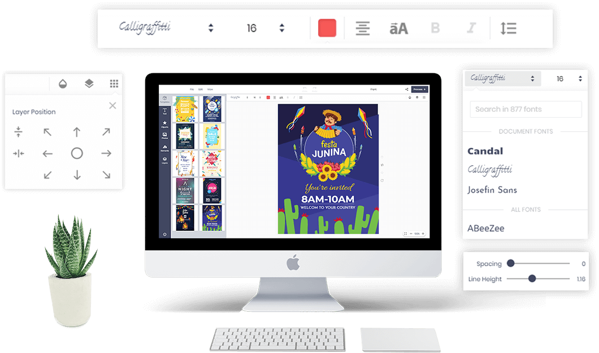

# Intro Online Design tool
We will intro basic info about Printcart Online Design Tool and How to use Online design tool.
Bellow is Online Design Display

## Navigation main bar
Navigation main bar include buttons: File, Edit, View, Undo, Redo, Title, and Process

- **File**: Customers can import or export design
- **Edit**: Clear All Design. Besides, we will develop "save design for late" function to your registered customers can save their design
- **View**: There are many functions for designers: Ruler, Show Grid, Show Bleed Line, Show Dimensions, Show Warning
- **Title**: you can write name project for your design

## Navigation Main Tab
Navigation main tab include tabs: Text, Cliparts, Photos, Elements, Layers
- **Text**: There are more 500 Text fonts. Overmore, Shop owners can upload your font to Design Tool.
- **Cliparts**: There are 700 cliparts and you can add any more cliparts for your Printstore.
- **Photo**: Your customers can add any photos to their design follow 2 ways
    - Upload to Online Design
    - Get photo from any image link on the Internet
- **Element**: Includes most online design functionality required:
    - Draw (by mouse): Customers can free draw by choose brush: Pencil, Circle, Spray. Besides, they can draw many other lines and Shapes.
    - Shapes: There are 500 Shapes on Element tab
    - Icons: More than 500 impressive icon templates ready to use
    - Bar/QR-Code: Easy insert your website address by QR/bar-Code
    - Grid Frame: Layout grids help customers to align design objects within a frame.
    - Photo Frame: Create creative Design on Product with special Frame.
    - Image Place Older: You can add or custom shape on design with SVG code
- **Layers**: Easily arrange design layers simply like traditional design tools
## Main ToolBar
Each new function tab will have its own unique toolbar
- With Text main Toolbar have: Font, Size, Color, Text Align, Uppercase, Bold, Italic, Line height and spacing, strocke, and Background.
- Cliparts: Group and ungroup function
- Photo: Filter and Cliping mask
- Element: Group and color
## Common ToolBar
Online Design tool will have some common function for each layer.
- Angle: With the angle tool, you can save a lot of time measuring and easily adjusting layers.
- Opacity: The layer opacity change in the document window as you move the slider.
- Shadow: Use for a drop shadow is to simulate 3D depth in a 2D image
- Layer Stack: Use layers stack to perform tasks compositing multiple images, adding text to an image, or adding vector graphic shapes, adding a special effect such as a drop shadow or a glow.
- Layer Postion: Use to align the position of the layer in the design frame.