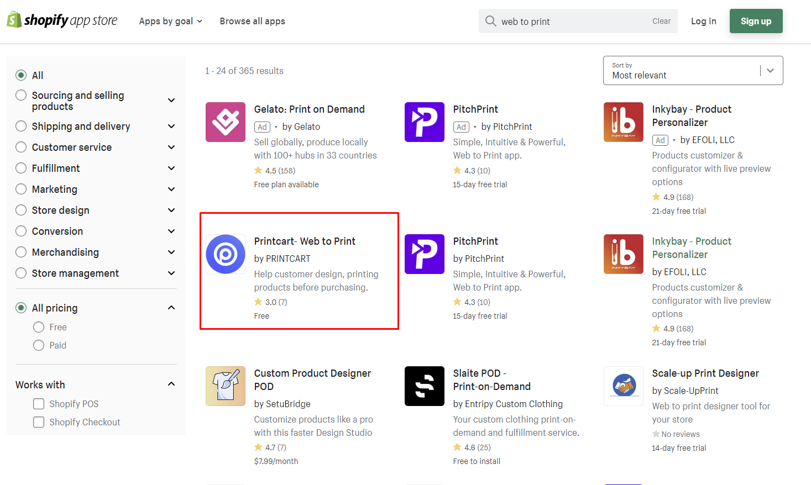

# Integrations
Printcart compatible the most ecommerce platforms. This document will guide you How to setup Printcart for each other platforms.

## Shopify

**How to set up and use on Shopify:**

<iframe width="854" height="480" src="https://www.youtube.com/embed/Vbf6AfVwqOM" title="YouTube video player" frameborder="0" allow="accelerometer; autoplay; clipboard-write; encrypted-media; gyroscope; picture-in-picture" allowfullscreen></iframe>

### 1. Integrate Printcart with Shopify Store

Open the Shopify app store by clicking “Apps” → Visit the Shopify App Store.


Here you can find our app by searching for “Printcart”.



Next, press Add app → Install app to proceed.


### 2.  Define a Design Area in Printcart

On the dashboard of Printcart. Choose a product you want to design => Continue.


Select the design area for the product by uploading an image to the Printcart then align the design area size


After filling in the size information => Continue


Now you can visit your Printcart Dashboard or visit your store to check out your work.


### 3. How Printcart works on your website

In your website store, the product you selected shows an additional "start design" button


After completing your product design with the toolbar on the left, select process


Then click X to return to the Product Page


The design you just created will be displayed on the product page: 


After completing the order process, the order will be displayed on the admin Shopify and the dashboard Printcart simultaneously.


Your final step is to select that order on our printcart dashboard then print them to a pdf file then print on your product


Then download a pdf file.


Finally, you print this pdf file and proceed to print it on your customer's product.


## WordPress

### 1. Install Printcart Plugin on Woocommerce Website

**Step 1: Install & Activate Printcart**

Log in to your WooCommerce account and go to the admin panel. There, open *Plugins.
In Plugins, click on Add new.


In the search box, search "Printcart" for WooCommerce. Choose Install to install this plugin, and when the installation is complete, the Install button will turn into Activate, click on it.


**Step 2: Connect the Printcart Dashboard to your site**

After activating, Printcart will be shown in your WordPress dashboard, click on Connect to Dashboard


Afterward, you will be required to enter your WooCommerce store name. When it is done, you can start publishing your products from Printcart to WooCommerce.


### 2. Define a Design Area in Printcart Dashboard
[Same Shopify](#2--define-a-design-area-in-printcart)
### 3. How Printcart works on your Woocommerce Website
[Same Shopify](#3-how-printcart-works-on-your-website)
## Magento
### How to install & upgrade Printcart_Design

#### 1. Install via composer (recommend)

We recommend you to install Printcart_Design module via composer. It is easy to install, update and maintaince.

Run the following command in Magento 2 root folder.

**1.1 Install**

```
composer require printcart/magento-integration
php bin/magento setup:upgrade
php bin/magento setup:static-content:deploy
```

**1.2 Upgrade**

```
composer update printcart/magento-integration
php bin/magento setup:upgrade
php bin/magento setup:static-content:deploy
```

Run compile if your store in Product mode:

```
php bin/magento setup:di:compile
```

#### 2. Copy and paste

If you don't want to install via composer, you can use this way. 

- Download [the latest version here](https://github.com/Printcart/magento-integration/archive/main.zip) 
- Extract `main.zip` file to `app/code/Printcart/Design` ; You should create a folder path `app/code/Printcart/Design` if not exist.
- Go to Magento root folder and run upgrade command line to install `Printcart_Design`:

```
php bin/magento setup:upgrade
php bin/magento setup:static-content:deploy
```
### How to integrate Printcart API to Magento (Adobe Commerce) website

<iframe width="854" height="480" src="https://www.youtube.com/embed/5Q5igif_gks" title="YouTube video player" frameborder="0" allow="accelerometer; autoplay; clipboard-write; encrypted-media; gyroscope; picture-in-picture" allowfullscreen></iframe>
