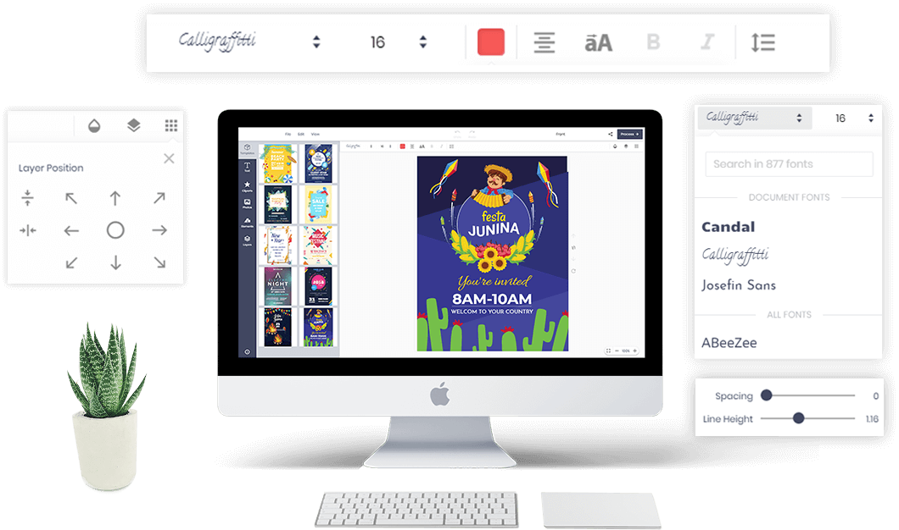

# Online Design App
We will intro basic info about Printcart Online Design App and How to use this app
Bellow is Online Design Display

## Before Start
The Online Design App has the sections:
### Top toolbar
Top toolbar include buttons: File, Edit, View, Undo, Redo, Title, and Process

- **File**: Users can import or export designs.
- **Edit**: Have Clear All Design function. Besides, we will develop a "save the design for late" function to your registered users can save their design.
- **View**: There are many functions for designers: Ruler, Show Grid, Show Bleed Line, Show Dimensions, Show Warning.
- **Undo and Redo**: Click to go back and go foward design steps.
- **Title**: you can write name project for your design.
- **Process**: Complete to create project.

### Main Tab
The main tab has a position at the vertical column on the left side of the interface. It includes tabs: Text, Cliparts, Photos, Elements, Layers.
- **Text**: You can edit or upload your font on Designs.
- **Cliparts**: Cliparts can be stylized text, art patterns, complex textures designs by SVG files that you have configured in the dashboard.
- **Photo**: Your customers can add any photos to their design in 3 ways.
    - Upload to Online Design.
    - Get photo from any image link on the Internet.
    - From Linked Free Photos Platforms.
- **Element**: Includes almost all online design functions such as
    - Draw (by mouse): Customers can free draw by choosing brush: Pencil, Circle, Spray. Besides, they can draw many other lines and Shapes.
    - Shapes: add Shapes on the Element tab.
    - Icons: You can add more than 500 impressive icon templates ready to use.
    - Bar/QR-Code: Easily insert your website and product information address by QR/bar-Code.
    - Grid Frame: Layout grids help customers to align design objects within a frame.
    - Photo Frame: Create other designs on Product with a special Frame.
    - Image Place Older: You can add or custom shape on design with SVG code.
- **Layers**: Easily arrange design layers simply like traditional design tools.
### Main ToolBar
Each new function tab will have its own unique toolbar
- With Text main Toolbar have Font, Size, Color, Text Align, Uppercase, Bold, Italic, Line height and spacing, stroke, and Background.
- Cliparts: Group and ungroup function
- Photo: Photo: Filter and clipping mask
- Element: Group layers and change colors
### Common ToolBar
Online Design App will have some common function for each layer.
- Angle: With the angle tool, you can save a lot of time measuring and easily adjusting layers.
- Opacity: The layer opacity change in the document window as you move the slider.
- Shadow: Use for a drop shadow is to simulate 3D depth in a 2D image
- Layer Stack: Use layers stack to perform tasks compositing multiple images, adding text to an image, or adding vector graphic shapes, adding a special effect such as a drop shadow or a glow.
- Layer Position: Use to align the position of the layer in the design frame.

## How to use Online Design App

### Add Text
You can add text with various colors, fonts, and sizes. Especially, they can curve text in their design and edit anything of text as a shadow, pattern, rotation, opacity, outline, line height, background, etc. Actions and techniques designed that users can perform include:

- Any text and font are available for your choice.
- There are plenty of fonts being included in the font category
- Font style includes italic, bold, underline with the full type of alignment such as left, center, right, or justified.
- Font color is varied.
- Text background is available and changeable.
- Text pattern is available.
- Creating text shadow according to dimension X or Y. Shadow blur, opacity, shadow color also can be changeable.
- Line height, font size, and opacity are changeable.
- The outline’s color and size are changeable.
- Text layer can be measured.
- Text can be turned, curved, or rotated/reversed.
- Spacing is changeable.
- Default style such as arc, straight, small to large, large to small top, large to small bottom is changeable.

### Add Clipart
- You can add art, change colors, move, resize, rotate and delete art, flip, center function and so on
- Customize art colors. It not only gives a simple function to manage color but also allows customers to change the color of each part of this image
- You can rotate and change its opacity.
- Zoomed in or zoomed out Art.
- Art can be moved or deleted.
- You can add multi-art to one design

### Upload Images
- If customers do not satisfy with the template, they can upload images as they want.
- Customers can upload images from a computer, images source, or social network such as Facebook.
- Temporarily saved uploaded files for later use.
- You can upload file types like PNG, JPG, GIF. Can adjust the maximum size in the backend.
- Zoom or rotate Arts easily.
- Creating text shadow according to dimension X or Y. Easy change shadow blur, opacity, shadow color.
- Customize the picture’s opacity
- Four types of quick-changing pictures are available.
- Turn the picture with the tool.
- Various picture crop styles such as crop tool, lasso tool, heart shape, round or star shape, etc. You can reset the picture back to its origin.

### Create Design Elements
**Free-hand drawing**
- You can use many available brushes to draw. You can create your own signature.
- Drawing brushes such as pencil, circle, spray, pattern, square, texture are available for different choices.
- Can change the brush and brush width color.
- Add available geometries as a rectangle, circle, triangle, line, and polygon. Besides, users can change color, rotate, and opacity.

**More professional by add QR code**
- You can create a QR code on your design. QR codes will help customers access the link they want on Design
- Can zoom QR pictures in according to the needs of the customers.

### Powerful layers
- Drag and drop to sort layers and change layers of items
- You can drag layer positions to different positions.
- Can delete layer positions partly or entirely.
- Create a scroll when multiple layers exist.
- You can use buttons to change the layer’s position.
- Display or hidden layers easily.